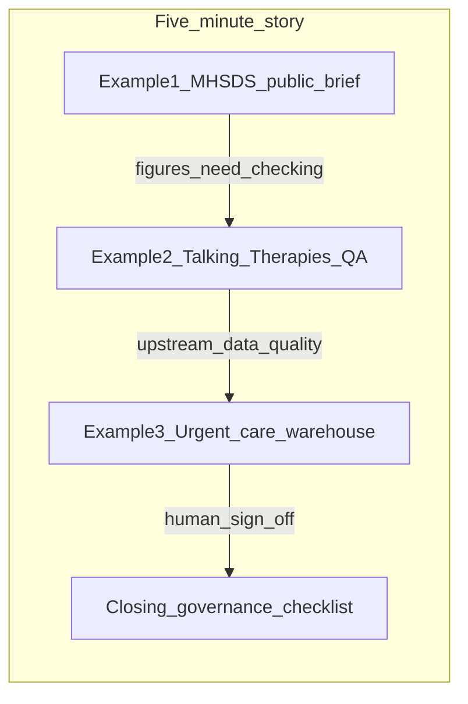

# Five-minute website video plan

## Recommended video title

**Turning NHS data into useful performance intelligence — a practical demonstration**

## One-sentence core message

This site shows how I would support Business & Performance work: turning published mental health data into clear performance intelligence, checking figures before they are shared, and distinguishing real service pressure from data artefacts — with AI used safely under human control.

---

## Evidence audit of candidate examples

| Candidate | What it demonstrates | Supporting files | Person-spec skills | 5-min strength | Verdict |
|-----------|---------------------|------------------|-------------------|----------------|--------|
| **MHSDS public-data briefing** | Six-month MH access/activity trends; stock vs activity divergence; MHS69 validation flag; reproducible public pipeline | [site/reports/public-mh-access-profile.html](../site/reports/public-mh-access-profile.html), [site/draft-reports.html](../site/draft-reports.html), [site/public-data/processed/trend_mhsds_access_rdy.csv](../site/public-data/processed/trend_mhsds_access_rdy.csv), [site/R/03_render_public_reports.R](../site/R/03_render_public_reports.R) | PS 1.4, 1.6, 5.4, 5.11; mental health reporting; communication | **Very strong** — credible RDY public data, visually compelling MHS69 spike | **INCLUDE (Example 1)** |
| **Talking Therapies QA arc** | Flawed draft caught before publication; national standards applied; automated validation; refusal to approve | [site/examples/synthetic-draft-talking-therapies-flawed.md](../site/examples/synthetic-draft-talking-therapies-flawed.md), [site/docs-html/examples/report-analysis-agent-conversation.html](../site/docs-html/examples/report-analysis-agent-conversation.html), [site/reports/public-talking-therapies-profile.html](../site/reports/public-talking-therapies-profile.html), [site/R/04_validate_public_reports.R](../site/R/04_validate_public_reports.R) | PS 2.4, 5.1; governance; performance management; complex analysis | **Excellent** — clearest before/after story on site | **INCLUDE (Example 2)** |
| **Synthetic urgent-care warehouse analysis** | Jan–Feb multi-source pressure vs March extract artefact; capacity/demand triangulation; upstream DQ thinking | [site/warehouse-demo/reports/synthetic-urgent-care-analysis.html](../site/warehouse-demo/reports/synthetic-urgent-care-analysis.html), [site/data-warehouse-agent-demo.html](../site/data-warehouse-agent-demo.html), [site/warehouse-demo/profile-output/volume_trends.csv](../site/warehouse-demo/profile-output/volume_trends.csv) | PS 4.2, 4.3, 5.4; SQL/warehouse; service improvement | **Very strong** — dramatic detective narrative; complements RDY briefs | **INCLUDE (Example 3)** |
| MHSDS SME agent conversation | Lineage trace; refuses over-interpretation; separates DQ from operational hypotheses | [site/examples/mhsds-sme-agent-conversation.md](../site/examples/mhsds-sme-agent-conversation.md), [site/agent-operating-model.html#mhsds-worked-example](../site/agent-operating-model.html) | PS 1.6, 2.4; responsible AI | Strong but **synthetic** — overlaps Example 1 MH theme | **REJECT as main example** — mention briefly in closing if time |
| Mandatory reporting map | Returns register; owners, frequency, risk; AI maintenance concept | [site/mandatory-reporting-map.html](../site/mandatory-reporting-map.html) | PS 1.6, 2.4 | Good organisational demo; thin for 75s deep dive | **REJECT** — reference in opening as “also on site” |
| NOF performance overview | Trust-wide peer comparison; priority flags (OF0063 long-stay) | [site/reports/public-performance-overview.html](../site/reports/public-performance-overview.html) | PS 1.4, 1.5 | Strong but duplicates “performance brief” pattern; less MH-specific | **REJECT** — MHSDS is stronger for MH focus |
| Agent operating model (standalone) | Bounded agents; workflow diagram; rule catalogue | [site/agent-operating-model.html](../site/agent-operating-model.html) | PS 2.4; leadership/innovation | Meta-framework; better as thread than standalone example | **REJECT** — woven through Examples 2–3 |
| Governance checklist (standalone) | Nine-point human gate before sharing | [site/governance-and-benefits.html#checklist](../site/governance-and-benefits.html) | PS 2.4, 5.11 | Essential but short — works as **closing**, not deep example | **REJECT as example** — use in closing |
| Warehouse design / profiling conversations | Source profiling; dimensional model; human review pack | [site/examples/warehouse-design-conversation.md](../site/examples/warehouse-design-conversation.md), [site/docs-html/warehouse-demo/design/warehouse_design_proposal.html](../site/docs-html/warehouse-demo/design/warehouse_design_proposal.html) | PS 4.2, 2.8 | Technical depth but less dramatic than urgent-care Jan/Mar story | **REJECT** |
| Warehouse report QA conversation | Same flawed→corrected pattern on DRH data | [site/examples/warehouse-report-qa-conversation.md](../site/examples/warehouse-report-qa-conversation.md) | PS 2.4, 5.1 | Strong but redundant with Example 2 QA arc | **REJECT** |
| Public-data pipeline / source register alone | Reproducible R workflow; 12 registered sources | [site/public-data/DATA_SOURCE_REGISTER.csv](../site/public-data/DATA_SOURCE_REGISTER.csv), [site/public-data/PUBLIC_REPORTS_METHOD.md](../site/public-data/PUBLIC_REPORTS_METHOD.md) | PS 1.6, 4.3 | Important supporting evidence; not a narrative on its own | **REJECT** — brief mention in Example 1 |
| Community services / assurance / urgent diagnostics briefs | CSDS activity; KO41a map; A&E applicability | [site/reports/public-community-services-profile.html](../site/reports/public-community-services-profile.html), etc. | PS 1.6, 5.4 | Solid but secondary to MH examples for this role | **REJECT** |
| Legacy synthetic reports (orphaned) | Early prototypes | `site/reports/demand-and-capacity-prototype.html`, etc. | Weak | Not linked from site nav; outdated nav | **REJECT** |

### Why these three work better than alternatives

1. **Covers the whole site in three layers**, not three pages: public RDY reporting (Example 1) → assurance before sharing (Example 2) → upstream warehouse thinking (Example 3) → governance close.
2. **Two mental health reporting angles** (MHSDS + Talking Therapies) meet the MH emphasis without feeling repetitive — one is descriptive trend intelligence, the other is pre-publication QA.
3. **RDY vs DRH separation** is naturally explained: Examples 1–2 use real public Dorset data; Example 3 uses fictional Demo Rivers Health synthetic warehouse — matching [site/index.html](../site/index.html) three-strand architecture.
4. **Beats MHSDS SME agent** because the public MHSDS brief uses real NHS aggregates and a reproducible pipeline; the SME conversation is synthetic and better as a one-line reference to the agent operating model.
5. **Beats mandatory map / NOF** because deep analytical evidence (MHS69 flag, 5,870 vs 6,780 error, Jan–Feb vs March triangulation) is more memorable than register browsing or dense oversight tables in 75 seconds.

---

## Chosen three-example structure

| Segment | Example | Core message |
|---------|---------|--------------|
| 0:30–1:45 | **MHSDS public briefing** | I turn published NHS mental health data into structured performance intelligence — figure, trend, caveats, owner checks |
| 1:45–3:00 | **Talking Therapies QA arc** | I check drafts against sources and standards before anyone shares them — agents assist, humans decide |
| 3:00–4:25 | **Urgent-care warehouse analysis** | I triangulate upstream data to separate real pressure from extract artefacts — the work behind the numbers |
| 4:25–5:00 | **Closing** | Governance checklist + why this matters for the BP role |

---

## Browser tab plan

**Open before recording** (left-to-right tab order):

| Tab | URL / path | Used in |
|-----|------------|---------|
| 1 | [site/index.html](../site/index.html) | Opening 0:00–0:30 |
| 2 | [site/reports/public-mh-access-profile.html](../site/reports/public-mh-access-profile.html) | Example 1 |
| 3 | [site/docs-html/examples/report-analysis-agent-conversation.html](../site/docs-html/examples/report-analysis-agent-conversation.html) | Example 2 (primary) |
| 4 | [site/examples/synthetic-draft-talking-therapies-flawed.md](../site/examples/synthetic-draft-talking-therapies-flawed.md) or HTML render if preferred | Example 2 (quick flash of flawed draft) |
| 5 | [site/reports/public-talking-therapies-profile.html](../site/reports/public-talking-therapies-profile.html) | Example 2 (corrected outcome) |
| 6 | [site/warehouse-demo/reports/synthetic-urgent-care-analysis.html](../site/warehouse-demo/reports/synthetic-urgent-care-analysis.html) | Example 3 |
| 7 | [site/governance-and-benefits.html#checklist](../site/governance-and-benefits.html) | Closing |

**Optional reference tab** (do not switch unless asked): [site/draft-reports.html](../site/draft-reports.html) — only if you want to show the six-brief hub for 5 seconds in the opening.

**Local server:** Serve `site/` via a simple HTTP server so relative links work (e.g. `python -m http.server 8080` from `site/`).

---

## Timed visual plan

### 0:00–0:30 — Opening / purpose

| Element | Detail |
|---------|--------|
| **On screen** | Tab 1 — [site/index.html](../site/index.html) |
| **Scroll to** | Hero heading “A practical demonstration of Business & Performance work” |
| **Point at** | Subtitle “public and synthetic data only”; card grid under “Purpose of this site” |
| **Key phrase visible** | “turning data into clear performance intelligence” |
| **Person-spec (subtle)** | Communication (PS 2.5); performance management framing (PS 1.4) |

### 0:30–1:45 — Example 1: MHSDS mental health briefing

| Element | Detail |
|---------|--------|
| **On screen** | Tab 2 — [site/reports/public-mh-access-profile.html](../site/reports/public-mh-access-profile.html) |
| **Scroll to** | “Headline reading” → priority callout on MHS69 → six-month measures table (MHS23, MHS01, MHS29 rows) → MHS69 chart |
| **Point at** | “Rising” badges on open referrals; “Broadly stable” on contacts; “Volatile” on MHS69; “MAJOR VALIDATION FLAG” |
| **Key phrase visible** | “open-referral stock measures rose while contact volume was broadly stable” |
| **Person-spec** | Mental health reporting (PS 1.6); complex KPI analysis (PS 5.4); NHS monitoring; communication |

### 1:45–3:00 — Example 2: Talking Therapies assurance before sharing

| Element | Detail |
|---------|--------|
| **On screen** | Tab 3 → flash Tab 4 → Tab 5 |
| **Scroll to** | Findings table row #1 (Critical: 5,870 vs 6,780) → Turn 4 publication refusal → corrected brief KFE row for M053 |
| **Point at** | “No. I cannot approve publication”; M053 “88%” with “Falling” and “≥75%” standard |
| **Key phrase visible** | “above the 75% six-week access standard but has fallen from 95%” |
| **Person-spec** | Governance/transparency (PS 2.4); performance management; responsible AI; data analysis (PS 5.1) |

### 3:00–4:25 — Example 3: Upstream data — real pressure vs artefact

| Element | Detail |
|---------|--------|
| **On screen** | Tab 6 — [site/warehouse-demo/reports/synthetic-urgent-care-analysis.html](../site/warehouse-demo/reports/synthetic-urgent-care-analysis.html) |
| **Scroll to** | Caveat box (DRH not RDY) → Jan–Feb escalation finding → March spike finding |
| **Point at** | Jan–Feb “Likely genuine”; March “Likely artefactual”; cases without SourceContactId 322 of 542 |
| **Key phrase visible** | “distinguishing genuine operational pressure from extract or attribution artefacts” |
| **Person-spec** | SQL/warehouse (PS 4.2); capacity/demand; service improvement; complex multi-source analysis |

### 4:25–5:00 — Closing / why this matters for the role

| Element | Detail |
|---------|--------|
| **On screen** | Tab 7 — [site/governance-and-benefits.html#checklist](../site/governance-and-benefits.html) |
| **Scroll to** | AI assurance checklist — tick 2–3 items verbally (definition linked, human reviewed, caveats visible) |
| **Optional flash** | Tab 1 “How this was built” for one sentence on Cursor |
| **Key phrase visible** | “Before any AI-assisted performance output is shared” |
| **Person-spec** | Governance (PS 2.4); champion performance management (PS 5.11); leadership/judgement |

---

## Full spoken script (~720 words)

### 0:00–0:30 — Opening

This is my personal demonstration site for the Business and Performance Business Partner role.

I built it with a Cursor agent, under my direction, to show how I would approach the work in practice — not just list skills on a form.

The site has three strands: six draft briefs from published NHS data for Dorset HealthCare; a separate synthetic warehouse example for a fictional trust; and pages on governance and bounded AI agents.

Everything here is a demonstration. It uses public or clearly marked synthetic data only. A named person would still check definitions and sign off before operational use.

I am going to walk through three worked examples that show how I think about performance, assurance, and the data behind the numbers.

### 0:30–1:45 — Example 1: MHSDS

First, mental health reporting from published NHS data.

This MHSDS brief uses six months of public Provider data for Dorset HealthCare. I asked an agent to structure it — but I set the question, reviewed the output, and directed the caveats.

The headline is not a simple good-or-bad score. Open referrals and people with an open referral have risen over six months. Contact volume is broadly stable. That pattern might mean caseload pressure — or coding, discharge, or case-mix effects. The brief says so openly.

MHS69 is the eye-catching line. It jumps from 310 to 1,505 in one month. The brief flags that as a major validation issue — not proof of sudden improvement. Financial-year counting logic may explain it. A CYP data owner would need to confirm before anyone acted on it.

Each brief follows the same discipline: what the figure is, the trend, what it cannot tell you, and who must confirm locally. The figures trace back through an R pipeline and a source register — so the work is reproducible, not hand-waved.

### 1:45–3:00 — Example 2: Talking Therapies QA

Second, checking a draft before it reaches a meeting.

Here is a deliberately flawed Talking Therapies access brief. The author draft says performance is strong. The Report Analysis agent catches problems before publication.

Finding one is critical. The waiting-list total is wrong — 5,870 against a true sum of 6,780 from the source file. That would fail an automated validation check I built into the render pipeline.

Other findings matter too: legacy IAPT naming, a missing national 75% standard, and trend wording that mixes validation notes into the trend column.

The agent refuses to approve publication. The corrected brief on the site shows what a directorate huddle would actually need: 88% six-week access — still above the 75% standard, but falling from 95% in the trend window. That is a different conversation from “performance is strong.”

This is how I would use AI in practice. Fast first draft, rigorous check, human owner signs off. The agent assists. It does not decide.

### 3:00–4:25 — Example 3: Urgent-care warehouse

Third, the work behind the dashboard — using a synthetic warehouse example for fictional Demo Rivers Health. This is separate from the Dorset public briefs. Same thinking, different data.

The question is urgent care in early 2026. In January and February, contacts, operational cases, bank shifts and agency spend all move together. That looks like coordinated operational pressure worth a service conversation.

March tells a different story. Case opens rise, but urgent-care contacts fall sharply. Cases without a linked source contact jump from 123 to 322. The profiling work points to an extract rule change on the CareCase feed — effective the March run.

Without that upstream check, a performance lead might chase a demand spike that is really a data artefact. This demo walks through source profiling, warehouse design, SQL specs, and report QA — all agent-assisted, all with human review gates.

That extract-versus-operational discipline is exactly what a Business Partner needs when services ask whether the numbers reflect real pressure.

### 4:25–5:00 — Closing

Across the site, the same rule applies. Benefits from faster drafting and clearer structure — but hard controls before anything is shared.

This checklist is the human gate: approved data, definitions linked, denominators checked, caveats visible, named review. If anything raises doubt, escalate — do not quietly publish uncertain figures.

The site also covers a mandatory reporting map, an agent operating model, and five other public briefs. But the through-line is consistent.

I combine operational experience with hands-on data work. I know mental health reporting matters. I check before I share. I look upstream when the numbers do not feel right.

That is the approach I would bring to the Business and Performance Business Partner role. Thank you for watching.

---

## Person-spec mapping table

| Skill area | How the video demonstrates it | Primary evidence on screen |
|------------|--------------------------------|----------------------------|
| Performance management | Figure/standard/trend/caveats structure; “above standard but falling” TT reading; Jan–Feb pressure narrative | MHSDS headline; TT M053 row; urgent-care Jan–Feb table |
| NHS reporting / monitoring | MHSDS Provider/RDY scope; Talking Therapies national standards; six-brief public pipeline | MHSDS scope badge; TT standard citation; draft-reports hub (mention) |
| Mental health reporting | MHSDS MHS23/MHS01/MHS29/MHS69; Talking Therapies access and waits | `public-mh-access-profile.html`; `public-talking-therapies-profile.html` |
| Complex data analysis | Stock vs activity divergence; multi-source triangulation; extract change detection | MHSDS table; `volume_trends.csv` evidence in urgent-care analysis |
| SQL / data warehousing | Synthetic DRH pipeline; mart and profiling artefacts; QA views (mentioned) | `synthetic-urgent-care-analysis.html`; warehouse demo hub (mention) |
| Communication of complex information | Plain-English headlines, bottom lines, priority flags; non-technical framing throughout | All three example pages |
| Governance, transparency, accountability | QA refusal; validation scripts; checklist; RDY/DRH separation; demonstration caveats | Report Analysis conversation; governance checklist |
| Leadership / responsible innovation | Bounded AI under human direction; building site with Cursor as governed example; escalation when in doubt | “How this was built”; agent refusal; checklist closing |

---

## Final recording checklist

- [ ] Serve site locally from `site/` and test all tab URLs
- [ ] Set browser zoom ~110–125% so table text is readable on recording
- [ ] Hide bookmarks bar; use clean window or single-monitor capture
- [ ] Pre-scroll each tab to the section listed above; rehearse tab switches
- [ ] Speak at ~140–150 wpm (script ~720 words ≈ 4:50–5:10; trim closing if needed)
- [ ] State once early: “demonstration only, not official Dorset HealthCare reporting”
- [ ] State once before Example 3: “fictional Demo Rivers Health — separate from Dorset public data”
- [ ] Do not claim site proves senior management, contract negotiation, or formal qualifications (CV/interview)
- [ ] Optional: mic check; record 10-second silence at start for edit padding

---

## File paths used

**Site pages:** `site/index.html`, `site/draft-reports.html`, `site/mandatory-reporting-map.html`, `site/data-warehouse-agent-demo.html`, `site/agent-operating-model.html`, `site/governance-and-benefits.html`, `site/reports/public-mh-access-profile.html`, `site/reports/public-talking-therapies-profile.html`, `site/warehouse-demo/reports/synthetic-urgent-care-analysis.html`, `site/docs-html/examples/report-analysis-agent-conversation.html`

**Examples / conversations:** `site/examples/synthetic-draft-talking-therapies-flawed.md`, `site/examples/report-analysis-agent-conversation.md`, `site/examples/mhsds-sme-agent-conversation.md`

**Data / pipeline:** `site/public-data/DATA_SOURCE_REGISTER.csv`, `site/public-data/processed/trend_mhsds_access_rdy.csv`, `site/public-data/processed/demo_talking_therapies.csv`, `site/public-data/PUBLIC_REPORTS_METHOD.md`, `site/public-data/FINAL_REPORT_QA_SUMMARY.md`, `site/R/03_render_public_reports.R`, `site/R/04_validate_public_reports.R`, `site/warehouse-demo/profile-output/volume_trends.csv`

**Role / internal guides:** `docs/152-S030.26_Business_Performance_Business_Partner_Person_Specification.txt`, `docs/152-S030.26_Business_Performance_Business_Partner_Job_Description.txt`, `site/checks/site_explanation_guide.md`, `site/checks/business_performance_role_alignment_audit.md`, `site/checks/public_vs_synthetic_separation_audit.md`

**Broken links / inconsistencies:** None identified in navigation audit ([site/checks/final_link_navigation_audit.md](../site/checks/final_link_navigation_audit.md)). Note: `agent-rules/README.md` opens as raw Markdown in browser — use `site/docs-html/agent-rules/` HTML renders if showing agent rules on screen.
