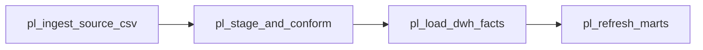

# ADF-style pipeline overview (demonstration specification)

> **Not deployed.** Fictional linked services and datasets for Demo Rivers Health warehouse demo.

## Orchestration

| Pipeline | Schedule | Depends on |
|----------|----------|------------|
| `pl_ingest_source_csv` | Daily 02:30 UTC | Source CSV drop |
| `pl_stage_and_conform` | Daily 03:00 UTC | Ingest complete |
| `pl_load_dwh_facts` | Daily 03:30 UTC | Staging DQ pass |
| `pl_refresh_marts` | Daily 04:00 UTC | Facts loaded |

## Linked services (fictional)

- `ls_demo_blob` — Azure Blob `demorivers-src` / `source-data/`
- `ls_demo_sql` — Azure SQL `DemoRiversDWH` (demo server placeholder)
- `ls_demo_keyvault` — Key Vault placeholder (no real secrets)

## DQ gates between activities

1. Row count vs `source_manifest.csv` tolerance ±0%
2. Referential integrity contact→case (warn not fail)
3. `date_boundary_mismatch_flag` summary logged
4. Extract change log join for reporting month

See JSON specs in this folder and [`pipeline_parameters.md`](pipeline_parameters.md).
